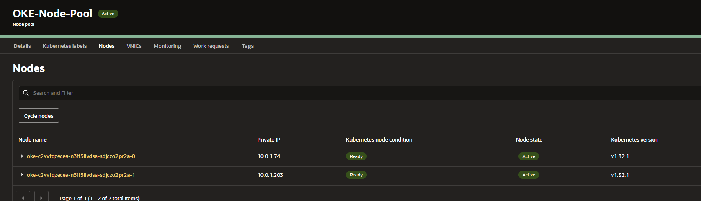
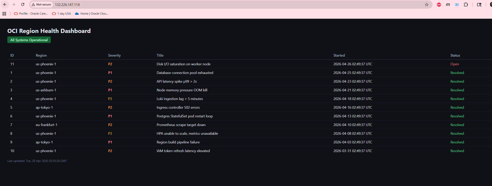
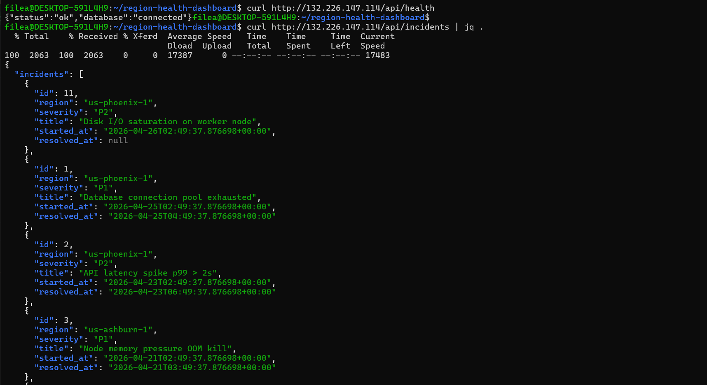
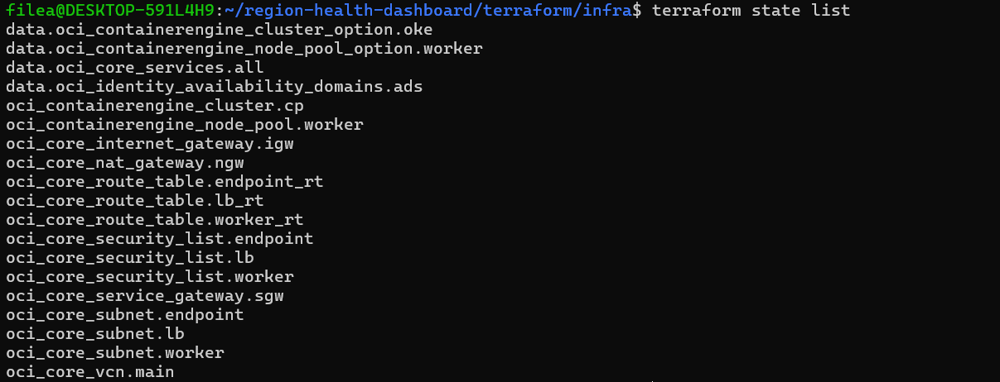
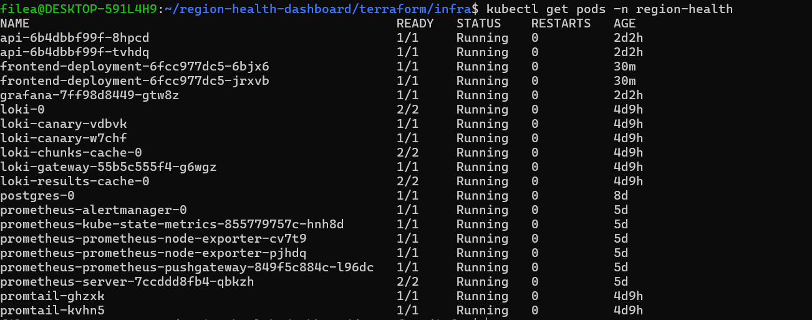
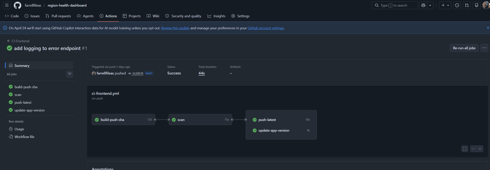
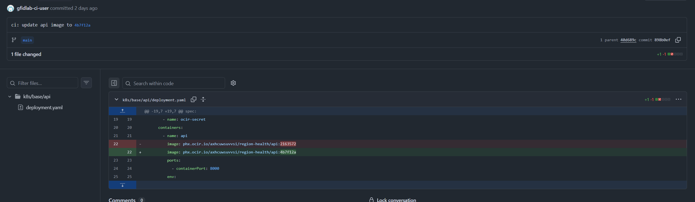
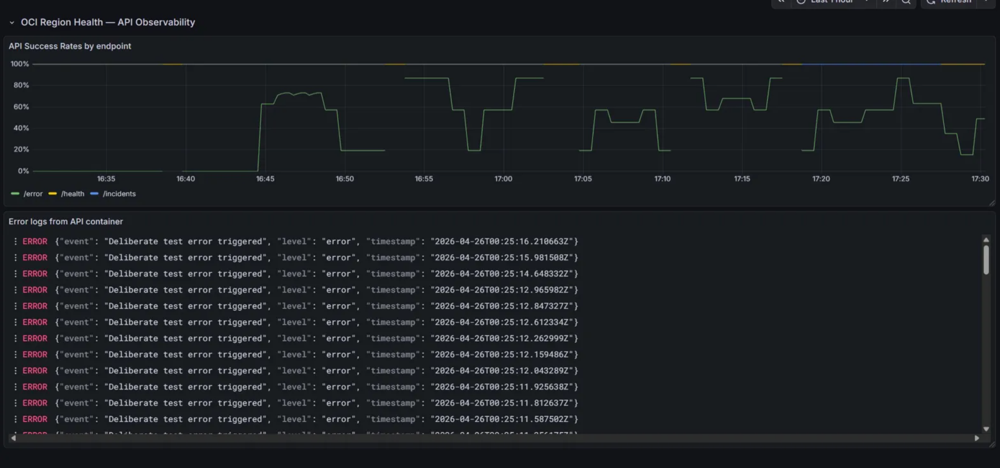

# OCI Region Health Dashboard

A production-grade SRE platform running on Oracle Kubernetes Engine (OKE), built to demonstrate end-to-end infrastructure ownership: Terraform provisioning, Kubernetes operations, GitOps deployment, and full-stack observability.

## Architecture

```
Internet
   │
   ▼
OCI Load Balancer (10.0.2.0/24)
   │
   ▼
ingress-nginx (NodePort)
   │  /        → frontend-service
   └  /api/**  → api-service (rewrite-target strips /api prefix)
   │
   ▼
OKE Worker Nodes (10.0.1.0/24)      OKE Endpoint (10.0.0.0/24)
   ├── FastAPI (2 replicas)
   ├── Frontend (1–2 replicas)
   ├── Postgres (StatefulSet + PVC)
   ├── Prometheus
   ├── Grafana
   └── Loki
```

**Cloud:** OCI
**Cluster:** OKE Enhanced Cluster — 2x `VM.Standard.E5.Flex` (2 OCPU / 16 GB RAM each)
**Total capacity:** 4 OCPU, 32 GB RAM, ~106 GB usable block volume



## Stack

| Layer | Technology |
|---|---|
| Infrastructure | Terraform + OCI |
| Orchestration | OKE (Kubernetes) |
| API | FastAPI (Python 3.11) |
| Database | Postgres 15 (StatefulSet) |
| Frontend | Static HTML |
| Metrics | Prometheus + `prometheus-fastapi-instrumentator` |
| Dashboards | Grafana (API success rates, error log exploration) |
| Logging | structlog (JSON) → Promtail → Loki → Grafana |
| CI | GitHub Actions (build / test / scan / push to OCIR) |
| CD | ArgoCD (GitOps, watches `k8s/base/`) |

## Live Deployment

This is a fully operational system running on OCI.

**Frontend Status Page:**


## Repo Structure

```
.
├── terraform/infra/        # OCI infrastructure — apply manually from WSL2
├── app/
│   ├── api/                # FastAPI service
│   ├── frontend/           # HTML status page
│   └── postgres/           # K8s manifests (schema canonical copy is in k8s/base/postgres/)
├── k8s/
│   └── base/               # Kustomize base — all manifests, watched directly by ArgoCD
├── observability/
│   ├── prometheus/
│   ├── grafana/
│   └── loki/
├── .github/workflows/
│   ├── ci-api.yml          # API build, test, scan, push
│   ├── ci-frontend.yml     # Frontend build, scan, push
│   └── cd.yml              # Placeholder — ArgoCD owns CD

```

## API Endpoints

| Method | Path | Description |
|---|---|---|
| `GET` | `/health` | Liveness + Postgres connectivity check |
| `GET` | `/metrics` | Prometheus metrics scrape endpoint |
| `GET` | `/incidents` | Last 50 incidents ordered by `started_at` |

### `/health` response

```json
{ "status": "ok", "database": "connected" }
```

Returns `503` with `"status": "degraded"` if Postgres is unreachable.

### `/incidents` response

```json
{
  "incidents": [
    {
      "id": 1,
      "region": "us-phoenix-1",
      "severity": "P2",
      "title": "Elevated error rate on compute API",
      "started_at": "2026-04-18T14:00:00Z",
      "resolved_at": "2026-04-18T15:30:00Z"
    }
  ]
}
```



## Database Schema

```sql
CREATE TABLE incidents (
    id          SERIAL PRIMARY KEY,
    region      VARCHAR(64)  NOT NULL,
    severity    VARCHAR(4)   NOT NULL CHECK (severity IN ('P1','P2','P3','P4')),
    title       TEXT         NOT NULL,
    started_at  TIMESTAMPTZ  NOT NULL DEFAULT now(),
    resolved_at TIMESTAMPTZ
);
```

## Infrastructure

Terraform is applied manually from WSL2 — never via CI.

```bash
cd terraform/infra
terraform init
terraform plan
terraform apply
```

**Required `terraform.tfvars` (gitignored):**

```hcl
tenancy_ocid     = "ocid1.tenancy.oc1..."
user_ocid        = "ocid1.user.oc1..."
compartment_id   = "ocid1.compartment.oc1..."
fingerprint      = "xx:xx:xx:..."
private_key_path = "~/.oci/oci_api_key.pem"
region           = "us-phoenix-1"
```

State is stored locally (`terraform.tfstate`, gitignored). In production this should use the OCI Object Storage S3-compatible backend defined in `backend.tf` for shared access and locking.



## Kubernetes

Manifests live in `k8s/base/` with a `kustomization.yaml` — ArgoCD detects Kustomize mode automatically and runs `kustomize build k8s/base` on every sync.

ArgoCD syncs automatically on merge to `main`.

**Manual apply:**

```bash
kubectl apply -k k8s/base
```

**Namespace:** `region-health`

All workloads use `app.kubernetes.io/` labels and explicit resource requests/limits.



## CI Pipeline

GitHub Actions runs independent workflows triggered by changes to specific app components.

### `ci-api.yml`
Triggers on changes to `app/api/**`:

1. Test FastAPI with Postgres (pytest)
2. Build API Docker image and push to OCIR
3. Scan image for critical vulnerabilities (Trivy)
4. Tag as `:latest`
5. Update `k8s/base/api/deployment.yaml` with new image SHA

### `ci-frontend.yml`
Triggers on changes to `app/frontend/**`:

1. Build frontend Docker image and push to OCIR
2. Scan image for critical vulnerabilities (Trivy)
3. Tag as `:latest`
4. Update `k8s/base/frontend/deployment.yaml` with new image SHA

**Note:** Changes to `app/postgres/**` do not trigger either workflow. The canonical schema lives in `k8s/base/postgres/schema.sql` and is mounted via Kustomize `configMapGenerator` into the Postgres pod at `/docker-entrypoint-initdb.d` — it runs once on a fresh PVC only.

All secrets (`OCIR_TOKEN`, `OCIR_USERNAME`, `OCIR_REGISTRY`, `OCIR_NAMESPACE`) are stored in GitHub Actions secrets — never in code.





## Observability

- **Prometheus** scrapes `/metrics` from the FastAPI pods
- **Grafana** displays API success rates by endpoint and error log exploration via Loki
- **Promtail** scrapes structured JSON logs from FastAPI pods and ships them to Loki

### Incident Detection

The `/incidents` endpoint queries a table seeded with demo data for visualization purposes. In a production system, this would be populated by:
- Prometheus alerting rules firing `critical` and `warning` alerts
- Alert handler writing incidents to the `incidents` table
- Grafana dashboard showing real-time incident status

For this demo, seed data is applied manually via `kubectl exec` into the Postgres pod.

Log format (stdout):

```json
{"event": "health_check", "status": "ok", "level": "info", "timestamp": "2026-04-20T10:00:00Z"}
```




## Prerequisites

| Tool | Version |
|---|---|
| kubectl | 1.35+ |
| Terraform | 1.14+ |
| Helm | 3.20+ |
| OCI CLI | 3.78+ |
| Docker | 29+ |
